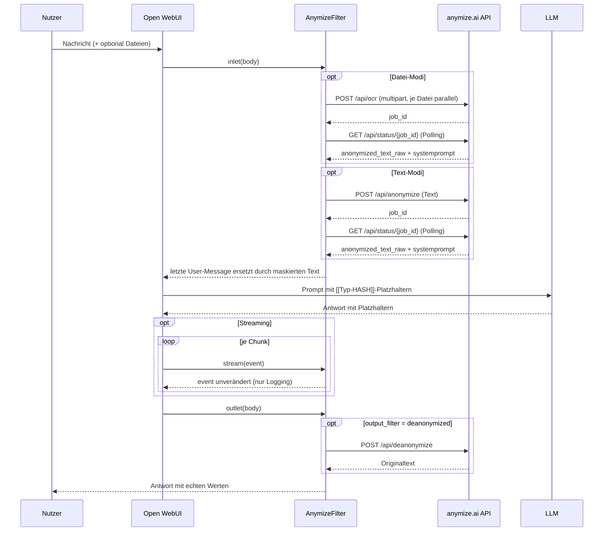

# AnymizeFilter

Ein [Open WebUI](https://github.com/open-webui/open-webui)-Filter, der personenbezogene Daten (PII) aus Chat-Eingaben entfernt, bevor sie an ein LLM gehen — und sie in der Antwort wieder einsetzt.

Die Anonymisierung selbst passiert nicht lokal, sondern über die externe API von [anymize.ai](https://app.anymize.ai). Der Filter ersetzt PII durch Platzhalter der Form `[[Typ-HASH]]` (z. B. `[[Person-QSEZB6]]`), schickt den maskierten Text ans Modell und macht die Maskierung nach der Antwort wieder rückgängig.

Der gesamte Filter steckt in einer Datei: [`anymize.py`](anymize.py).

---

## Funktionsweise



### Ablauf im Detail

1. **`inlet()`** wird von Open WebUI vor dem LLM-Aufruf gerufen und delegiert an `process_input()`.
2. **Dateien** (Modi `file_anonymization`, `text_file_anonymization`): `get_file_paths()` baut aus `body["files"]` die Pfade `UPLOAD_DIR/{file_id}_{filename}`. `process_multiple_files_for_ocr()` lädt alle Dateien parallel an `POST /api/ocr` hoch — zusammen mit der in der Valve `language` gesetzten Sprache —, sammelt die Job-IDs und pollt sie parallel bis `status == "completed"`. Ergebnis: `anonymized_text_raw` je Datei.
3. **Text**: der Text der letzten User-Message wird an den OCR-Text angehängt.
4. **Anonymisierung** (Modi `text_anonymization`, `text_file_anonymization`): der kombinierte Inhalt geht mit der konfigurierten Sprache an `POST /api/anonymize`, die zurückgegebene `job_id` wird über `GET /api/status/{job_id}` gepollt. Der von der API gelieferte `systemprompt` (Regeln zum korrekten Umgang mit Platzhaltern) wird an den Inhalt angehängt. Anschließend holt `_store_hash_pairs()` über `GET /api/status/{job_id}/strings` die vollständige Zuordnungstabelle, legt sie für spätere Nachbearbeitung in `__metadata__` ab und schreibt sie per `logging.warning` ins Serverlog (siehe [Datenschutz-Hinweis](#datenschutz-hinweis)).
5. **Pfadwahl**: ist eine der Kategorie-Valves gesetzt (`local_processing`) **und** liegen Hash-Paare vor, wird `final_content` lokal über `_anonymize_locally()` aus der Zuordnungstabelle gebildet; sonst ist es `anonymized_text_raw` der API — auch bei aktivem ZDR, wo es keine Paare gibt. Der `systemprompt` wird in beiden Fällen angehängt.
6. **Ersetzen**: die letzte User-Message im `body` wird durch `final_content` überschrieben. Open WebUI schickt sie so ans Modell. Auf dem API-Pfad sieht das LLM nur Platzhalter; auf dem lokalen Pfad nur so weit, wie die Kategorie-Valves reichen.
7. **`stream()`** wird bei aktivem Streaming für jeden Chunk der Antwort gerufen. Der Hook ist ein Prototyp: er gibt das `event` unverändert zurück und schreibt nur eine Log-Zeile je Aufruf (siehe [Datenschutz-Hinweis](#datenschutz-hinweis)). Der Chunk-Zähler liegt in `__metadata__`, nicht auf der Filter-Instanz.
8. **`outlet()`** wird nach der LLM-Antwort gerufen. Bei `output_filter = "deanonymized"` geht die Assistant-Nachricht an `POST /api/deanonymize`; das Ergebnis ersetzt die Antwort im Chat. Bei `"anonymized"` bleibt sie unverändert, die Platzhalter bleiben sichtbar.
9. **Statusmeldungen** („Processing files…", „Anonymizing content…", „De-anonymizing content…") laufen über `__event_emitter__` und erscheinen im Chat-Verlauf.
10. **Fehler**: `inlet()` meldet `❌ Anonymization failed: …` und wirft eine Exception — die Anfrage geht nicht ans LLM. `outlet()` wirft nicht, sondern stellt der Originalantwort die Fehlermeldung voran, damit die Antwort nicht verloren geht.

---

## Installation

1. In Open WebUI: **Admin Panel → Functions → `+`** (neue Function anlegen).
2. Inhalt von [`anymize.py`](anymize.py) einfügen und speichern. Titel, Autor und Version zieht Open WebUI aus dem Docstring am Dateianfang.
3. Function aktivieren und entweder global oder pro Modell zuweisen.
4. Unter **Valves** den API-Key hinterlegen (siehe unten).
5. Im Chat lässt sich der Filter über sein Icon ein- und ausschalten (`self.toggle = True`). Ist er aus, geben `inlet()` und `outlet()` den `body` unverändert zurück.

---

## Konfiguration (Valves)

| Valve | Default | Bedeutung |
|---|---|---|
| `backend_url` | `https://app.anymize.ai` | Basis-URL des anymize-Backends, ohne Pfad. Nur ändern, um eine self-hosted oder Staging-Instanz anzusprechen. Ein abschließender `/` wird abgeschnitten; leer gelassen greift wieder der Default. |
| `anymize_api_key` | `""` | API-Key von anymize.ai, Format `anymize_xxxxxxxxxxxxx`. Wird als `Authorization: Bearer …` gesendet. |
| `language` | `de` | Sprache der PII-Erkennung; gilt für `/api/anonymize` **und** `/api/ocr`. Mögliche Werte: `de`, `en`, `fr`, `es`, `it`. |
| `input_filter` | `text_anonymization` | Was vor dem LLM verarbeitet wird — siehe Modi unten. |
| `output_filter` | `deanonymized` | Was mit der LLM-Antwort passiert — siehe unten. |
| `allowed_categories` | `""` | Kommagetrennte PII-Kategorien, die maskiert werden. Leer = alle. ⚠️ Gesetzt schaltet die Anonymisierung auf den [lokalen Pfad](#lokale-anonymisierung) um; alles außerhalb dieser Kategorien geht im Klartext ans LLM. |
| `disallowed_categories` | `""` | Kommagetrennte PII-Kategorien, die **nicht** maskiert werden. Sticht `allowed_categories`. ⚠️ Gesetzt schaltet ebenfalls auf den lokalen Pfad um; Werte dieser Kategorien gehen im Klartext ans LLM. |
| `priority` | `10` | Ausführungsreihenfolge unter mehreren Filtern; kleinere Werte laufen zuerst. |

### `input_filter`-Modi

| Wert | Verhalten |
|---|---|
| `text_anonymization` | Nur die letzte User-Message wird über `/api/anonymize` maskiert. Dateien werden ignoriert. |
| `file_anonymization` | Angehängte Dateien laufen durch `/api/ocr` (OCR + Anonymisierung in einem Schritt). Maskiert wird gezielt nur der Dateiinhalt; der getippte Text der User-Message wird unverändert angehängt. Wer beides maskieren will, nimmt `text_file_anonymization`. |
| `text_file_anonymization` | Dateien per OCR **und** der kombinierte Gesamttext anschließend per `/api/anonymize`. |

### `output_filter`-Modi

| Wert | Verhalten |
|---|---|
| `deanonymized` | Antwort geht an `/api/deanonymize`, echte Werte werden wieder eingesetzt. |
| `anonymized` | Antwort bleibt unverändert; die Platzhalter `[[Typ-HASH]]` bleiben im Chat stehen. |

---

## Genutzte API-Endpunkte

Basis-URL: die Valve `backend_url`, per Default `https://app.anymize.ai`. Auth über `Authorization: Bearer <api_key>`. Alle Endpunkte unten hängen an dieser Basis, auch der Multipart-Upload nach `/api/ocr`.

| Endpoint | Zweck | Aufruf im Code |
|---|---|---|
| `POST /api/anonymize` | Text maskieren, liefert `job_id` | [`_anonymize_text()`](anymize.py:192) |
| `GET /api/status/{job_id}` | Job-Status + `anonymized_text_raw` + `systemprompt` | [`_get_anonymization_status()`](anymize.py:201) |
| `GET /api/status/{job_id}/strings` | Zuordnungstabelle Platzhalter ↔ Originalwert; wird in `__metadata__` abgelegt und ins Serverlog geschrieben | [`_get_hash_pairs()`](anymize.py:205), [`_store_hash_pairs()`](anymize.py:209) |
| `POST /api/deanonymize` | Platzhalter zurück in Originalwerte | [`_deanonymize_text()`](anymize.py:300) |
| `POST /api/ocr` | Datei (PDF, PNG, JPG, TIFF) per multipart, OCR + Anonymisierung | [`upload_file_from_path_for_ocr()`](anymize.py:309) |

Details zu Parametern und Antwortformaten: [`anymize_api.md`](anymize_api.md) bzw. <https://app.anymize.ai/api-docs/anonymization>.

Nicht genutzt vom Filter: der Endpoint `/api/v1/llm-anonymous/chat/completions` (anonymer Chat in einem Schritt).

---

## Code-Aufbau

Alles in `class Filter` in [`anymize.py`](anymize.py):

| Gruppe | Methoden |
|---|---|
| Konfiguration | `Valves` (pydantic-Model), `__init__()` — setzt `toggle` und das Inline-SVG-Icon, `base_url` (Property) — Basis-URL aus der Valve `backend_url`, ohne abschließenden `/`, `local_processing` (Property) — `True`, sobald eine der beiden Kategorie-Valves gesetzt ist |
| Zuordnungstabelle | `_get_hash_pairs()`, `_store_hash_pairs()` — Abruf, Ablage in `__metadata__`, Logging |
| Lokale Anonymisierung | `_parse_categories()`, `_filter_hash_pairs()`, `_anonymize_locally()` — Kategorie-Filter und Ersetzung anhand der Tabelle; aktiv, sobald `local_processing` `True` ist |
| HTTP | `_anymize_api_request()` — aiohttp-Wrapper für GET/POST mit Bearer-Auth |
| API-Calls | `_anonymize_text()`, `_get_anonymization_status()`, `_deanonymize_text()`, `upload_file_from_path_for_ocr()` |
| Job-Polling | `_poll_status()` — pollt bis `status == "completed"`, `max_retries=150`, `retry_interval=10000` ms |
| Datei-Handling | `get_file_paths()`, `process_multiple_files_for_ocr()` — Upload und Polling parallel via `asyncio.gather()` |
| Orchestrierung | `process_input()` — sammelt Inhalte, ruft die Anonymisierung, überschreibt die letzte User-Message |
| Open-WebUI-Hooks | `inlet()` (vor dem LLM), `stream()` (je Chunk, nur Logging), `outlet()` (nach dem LLM) — alle mit `__metadata__` |

### Hash-Paare in `__metadata__`

`__metadata__` ist ein Live-Dict, das Open WebUI durch den Request-Lebenszyklus reicht: was `inlet()` hineinschreibt, sieht `outlet()` desselben Requests ([Doku](https://docs.openwebui.com/features/extensibility/plugin/functions/filter/#data-passing-between-filters)). `_store_hash_pairs()` legt die vollständige Zuordnungstabelle dort für die spätere Nachbearbeitung ab — pro Request, nicht als geteilter Zustand der Filter-Instanz:

| Key (`Filter.METADATA_*`) | Inhalt |
|---|---|
| `_anymize_hash_pairs` | `List[Dict[str, Any]]` — ein Dict je erkannter Entität |
| `_anymize_job_id` | `str` — Job-ID der zugehörigen Anonymisierung |
| `_anymize_stream_chunks` | `int` — Zähler der `stream()`-Aufrufe dieses Requests |

Zugriff in `outlet()`:

```python
hash_pairs = (__metadata__ or {}).get(Filter.METADATA_HASH_PAIRS_KEY, [])
```

Je Eintrag werden die in `Filter.HASH_PAIR_FIELDS` gelisteten Felder übernommen: `original`, `hash`, `prefix_name`, `internal_id`, `placeholder`. Fehlende Felder werden als `None` abgelegt — `internal_id` ist in [`anymize_api.md`](anymize_api.md) nicht dokumentiert und kann je nach API-Version fehlen.

Beide Hooks deklarieren `__metadata__` mit Default `None`, und `_store_hash_pairs()` schreibt nur, wenn das Dict tatsächlich übergeben wurde. Ohne Metadata läuft die Anonymisierung unverändert weiter, die Paare stehen dann nur im Log.

Eine reale Antwort von `GET /api/status/{job_id}/strings` sieht so aus:

```json
{
  "job_id": "dcd158d9-c654-453b-872a-30180abbc48c",
  "count": 1,
  "hash_pairs": [
    {
      "original": "DS.1.3-2026-1899",
      "hash": "S28MBV",
      "prefix_name": "internal_id",
      "placeholder": "[[internal_id-S28MBV]]"
    }
  ]
}
```

`placeholder` trägt das vollständige Token in der Form, in der es im maskierten Text steht, `hash` nur den nackten Code. Die Beispiele in [`anymize_api.md`](anymize_api.md) (`placeholder: "PERSON-1"`, `hash: "[PERSON-1]"`) geben das nicht wieder — sie sind veraltet.

### Lokale Anonymisierung

> ⚠️ **Sobald eine der beiden Kategorie-Valves gesetzt ist, schaltet `process_input()` auf diesen Pfad um**: `final_content` ist dann der lokal maskierte Text, nicht mehr `anonymized_text_raw` der API. Alles, was die Kategorien nicht abdecken, geht im Klartext ans LLM.

`local_processing` ist eine Property, kein in `__init__()` gesetztes Attribut: Open WebUI weist `self.valves` **nach** der Konstruktion zu — und erneut, sobald die Valves im UI geändert werden. Ein in `__init__()` berechneter Wert würde deshalb nur die Defaults sehen und dauerhaft `False` bleiben. Als Property wird bei jedem Zugriff aus den aktuellen Valves gelesen. Reine Leerzeichen oder Kommas zählen dabei nicht als gesetzt, weil `_parse_categories()` sie verwirft.

`_anonymize_locally()` wendet die Zuordnungstabelle lokal auf einen Text an: jedes `original` wird durch das Feld aus `Filter.HASH_PAIR_REPLACEMENT_FIELD` (`placeholder`) ersetzt. Paare, bei denen eines der beiden Felder fehlt, werden übersprungen. Ersetzt wird **absteigend nach Länge des Originalwerts** — sonst würde ein kurzer Wert, der Teilstring eines längeren ist (`Berlin` in `Berliner Str. 42, 10115 Berlin`), den längeren zerschneiden, bevor dieser an die Reihe kommt.

#### Kategorie-Filter

`_filter_hash_pairs()` schränkt vorab ein, welche Paare überhaupt ersetzt werden — anhand des Felds `prefix_name` (die PII-Kategorie, z. B. `person`, `location`, `internal_id`):

| `allowed_categories` | `disallowed_categories` | Wirkung |
|---|---|---|
| leer | leer | alle Paare (Standard) |
| gesetzt | leer | nur die genannten Kategorien |
| leer | gesetzt | alle außer den genannten |
| gesetzt | gesetzt | die genannten aus `allowed`, minus `disallowed` — **`disallowed` sticht** |

Beide Listen werden kommagetrennt gelesen, Groß-/Kleinschreibung und umgebende Leerzeichen sind egal, leere Einträge werden ignoriert. Ein Paar ohne `prefix_name` bleibt erhalten, solange keine `allowed`-Liste aktiv ist; mit aktiver Whitelist fällt es raus, weil es keiner erlaubten Kategorie zugeordnet werden kann.

Der Filter wirkt nur auf `_anonymize_locally()`. Was in `__metadata__` liegt und was beim Logging der Zuordnungstabelle geschrieben wird, bleibt unberührt — die API kennt keinen Kategorie-Parameter, sie maskiert immer alles, was sie erkennt.

#### Auswahl des Pfads

In `process_input()`:

```python
if self.local_processing and hash_pairs:
    final_content = self._anonymize_locally(content_to_anonymize, hash_pairs)
else:
    final_content = result["anonymized_text_raw"]
```

Der `systemprompt` wird danach auf beiden Pfaden gleich angehängt.

Welcher Pfad gegriffen hat, steht in jedem Fall im Log:

| Fall | Meldung |
|---|---|
| lokal maskiert | `anonymized locally from N hash pairs (before category filtering)` |
| API-Text, keine Valves gesetzt | `using the anonymized text from the API` |
| API-Text, weil keine Hash-Paare da sind | `no hash pairs available (Zero Data Retention enabled?) — using the anonymized text from the API instead of local anonymization` |

**Rückfall auf den API-Text ohne Hash-Paare**: Zero Data Retention ist eine Kontoeinstellung, kein Request-Parameter — von hier aus sichtbar wird sie nur daran, dass `GET /api/status/{job_id}/strings` nichts liefert, weil anymize.ai unter ZDR keine Zuordnung speichert. Ohne Paare würde der lokale Pfad nichts ersetzen und die Original-Nachricht im Klartext ans Modell schicken; deshalb greift dann der API-Text, begleitet von einer Warnung im Log. Dasselbe gilt, wenn der Abruf der Tabelle fehlgeschlagen ist oder die API keine PII erkannt hat.

⚠️ **Sonst kann der lokale Pfad weiterhin Klartext ans LLM schicken.** Er maskiert nur, was in der gefilterten Zuordnungstabelle steht:

- Werte einer ausgeschlossenen Kategorie bleiben im Klartext stehen — genau das ist der Zweck der Valves, aber es heißt, dass diese PII das Modell erreicht.
- Filtern die Kategorien **alle** vorhandenen Paare weg, geht die unveränderte Original-Nachricht ans Modell. `process_input()` warnt dann (`replaced nothing — the message goes to the model unmasked`), verhindert den Versand aber nicht.

`_filter_hash_pairs()` protokolliert zusätzlich, sobald es Paare aussortiert.

---

## Voraussetzungen

- **Open WebUI** — der Filter importiert `open_webui.utils.misc.get_last_user_message` / `get_last_assistant_message` und `open_webui.config.UPLOAD_DIR`. Außerhalb von Open WebUI läuft die Datei nicht.
- **Python-Pakete**: `aiohttp`, `pydantic` (beide in Open WebUI bereits vorhanden).
- **anymize.ai-Account** mit API-Key.
- Für die De-Anonymisierung gilt laut API-Doku: der ursprüngliche Anonymisierungs-Job muss noch existieren, **Zero Data Retention (ZDR) muss im Account deaktiviert sein**, und nur derselbe Nutzer, der den Job erzeugt hat, darf de-anonymisieren. Mit aktivem ZDR liefert `/api/deanonymize` keine Originalwerte — dann ist nur `output_filter = "anonymized"` sinnvoll.

---

## Bekannte Einschränkungen

Stand der aktuellen Fassung von `anymize.py` (Version 1.0.0):

- **Langes blockierendes Polling**: `_poll_status()` versucht es bis zu 150-mal im Abstand von 10 s ([anymize.py:176](anymize.py:176)) — im Extremfall hängt eine Anfrage 25 Minuten, bevor der Timeout greift.
- **Keine Streaming-De-Anonymisierung**: `stream()` existiert, ersetzt aber nichts — es protokolliert nur. Die De-Anonymisierung bleibt in `outlet()` auf der fertigen Nachricht, der Nutzer sieht während der Ausgabe weiterhin die rohen Platzhalter.
- **Nur die letzte User-Message wird anonymisiert**: Ältere Nachrichten des Verlaufs gehen unverändert ans LLM. In laufenden Unterhaltungen können frühere Klartext-PII also weiterhin mitgeschickt werden.
- **Job-ID im Log**: `logging.warning(f"Anymize.ai JobID: …")` ([anymize.py:479](anymize.py:479)) schreibt die Job-ID jeder Anonymisierung auf Warn-Level ins Serverlog.
- **`__metadata__` ist nicht in jedem Aufrufpfad garantiert**: Laut Open-WebUI-Doku läuft `outlet()` bei WebUI-Requests und über `/api/chat/completed`; für direkte Aufrufe von `/api/chat/completions` braucht es `ENABLE_API_OUTLET_FILTERS` auf `dev`/kommenden Releases. In Pfaden ohne Metadata stehen die Hash-Paare nur im Log, nicht im Dict.
- **Der lokale Pfad maskiert weniger als die API**: Ist eine Kategorie-Valve gesetzt, ersetzt der Filter nur, was in der gefilterten Zuordnungstabelle steht. Fehlen Paare ganz (ZDR), greift der API-Text; filtern die Valves dagegen alle vorhandenen Paare weg, geht die Original-Nachricht im Klartext ans LLM — mit Warnung im Log, ohne Abbruch. Siehe [Auswahl des Pfads](#auswahl-des-pfads).
- **Die De-Anonymisierung in `outlet()` ist ab Open WebUI 0.10 unsichtbar**: `outlet()` schreibt das Ergebnis nur nach `message["content"]` ([anymize.py:645](anymize.py:645)), das Frontend rendert eine Assistant-Nachricht seit 0.10 aber aus den strukturierten `message["output"]`-Blöcken und greift auf `content` nur zurück, wenn keine da sind (`ContentRenderer.svelte`: `{#if output?.length}`). Bei einer gestreamten Antwort sind sie immer da — sichtbar bleibt der aus den Stream-Chunks zusammengesetzte Text mit Platzhaltern. Dasselbe gilt für die Fehlermeldung im `except`-Zweig ([anymize.py:673](anymize.py:673)). Nötig ist, `content` **und** `output` zu schreiben; das Backend vergleicht beide getrennt und speichert beide. Ein Proof of Concept dafür steckt in [`hook_logger.py`](hook_logger.py) hinter der Valve `outlet_overwrite`.

---

## Datenschutz-Hinweis

Der Filter schickt Chat-Inhalte und hochgeladene Dateien an `app.anymize.ai` — die Daten verlassen also die eigene Infrastruktur, bevor sie maskiert sind. Das ist bauartbedingt: die Erkennung der PII passiert bei anymize.ai, nicht lokal. Ob das zulässig ist, hängt vom Einsatzzweck und der vertraglichen Grundlage (Auftragsverarbeitung) ab.

**Die Zuordnungstabelle landet im Log**: Nach jeder Text-Anonymisierung ruft `_store_hash_pairs()` die Hash-Paare ab und schreibt sie per `logging.warning` ins Open-WebUI-Serverlog — inklusive der Originalwerte im Klartext (`original='Max Mustermann'`). Die PII steht damit unmaskiert an einer Stelle, die der Filter sonst gerade schützt; wer Logs weiterleitet, aggregiert oder langfristig aufbewahrt, sollte das einkalkulieren. Abschalten geht nur durch Entfernen des Aufrufs in `process_input()`.

**Bei Streaming landet die gesamte Antwort im Log**: `stream()` schreibt je Chunk eine `logging.warning`-Zeile mit dem vollständigen `event` — bei einer längeren Antwort sind das hunderte Zeilen, die zusammengesetzt den kompletten Text ergeben. Zum Streaming-Zeitpunkt stehen darin noch die Platzhalter; zusammen mit der ebenfalls geloggten Zuordnungstabelle lässt sich die Antwort im Klartext rekonstruieren. Abschalten geht nur durch Entfernen der Log-Zeile in `stream()`.

Die zweite Kopie in `__metadata__` ist dagegen auf den einzelnen Request begrenzt und wird mit ihm verworfen — kein geteilter Zustand zwischen Nutzern oder Chats.

Zero Data Retention ist eine Kontoeinstellung bei anymize.ai, kein Request-Parameter. Mit ZDR speichert anymize.ai keine Zuordnung zwischen Platzhalter und Originalwert — dann funktioniert die De-Anonymisierung in `outlet()` nicht mehr, die Zuordnungstabelle landet weder im Log noch in `__metadata__`, und die lokale Anonymisierung fällt auf den API-Text zurück.

---

## Autor & Lizenz

- Filter-Code: `bbojan` — <https://github.com/Bojan227>, Version 1.0.0 (aus dem Docstring in `anymize.py`).
- Dieses Repository: <https://github.com/Matze2010/AnymizeFilter>.
- Lizenz: nicht festgelegt — es liegt keine Lizenzdatei bei.
