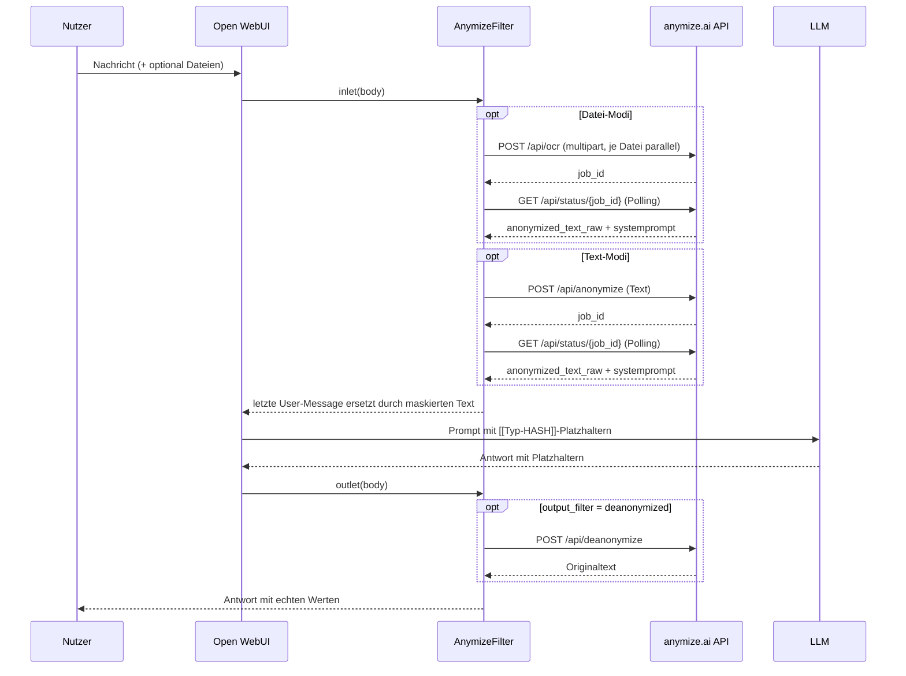

# AnymizeFilter

Ein [Open WebUI](https://github.com/open-webui/open-webui)-Filter, der personenbezogene Daten (PII) aus Chat-Eingaben entfernt, bevor sie an ein LLM gehen — und sie in der Antwort wieder einsetzt.

Die Anonymisierung selbst passiert nicht lokal, sondern über die externe API von [anymize.ai](https://app.anymize.ai). Der Filter ersetzt PII durch Platzhalter der Form `[[Typ-HASH]]` (z. B. `[[Person-QSEZB6]]`), schickt den maskierten Text ans Modell und macht die Maskierung nach der Antwort wieder rückgängig.

Der gesamte Filter steckt in einer Datei: [`anymize.py`](anymize.py).

---

## Funktionsweise

### Ablauf im Detail

1. **`inlet()`** wird von Open WebUI vor dem LLM-Aufruf gerufen und delegiert an `process_input()`.
2. **Dateien** (Modi `file_anonymization`, `text_file_anonymization`): `get_file_paths()` baut aus `body["files"]` die Pfade `UPLOAD_DIR/{file_id}_{filename}`. `process_multiple_files_for_ocr()` lädt alle Dateien parallel an `POST /api/ocr` hoch — zusammen mit der in der Valve `language` gesetzten Sprache —, sammelt die Job-IDs und pollt sie parallel bis `status == "completed"`. Ergebnis: `anonymized_text_raw` je Datei.
3. **Text**: der Text der letzten User-Message wird an den OCR-Text angehängt.
4. **Anonymisierung** (Modi `text_anonymization`, `text_file_anonymization`): der kombinierte Inhalt geht mit der konfigurierten Sprache an `POST /api/anonymize`, die zurückgegebene `job_id` wird über `GET /api/status/{job_id}` gepollt. Der von der API gelieferte `systemprompt` (Regeln zum korrekten Umgang mit Platzhaltern) wird an den Inhalt angehängt.
5. **Ersetzen**: die letzte User-Message im `body` wird durch den maskierten Inhalt überschrieben. Open WebUI schickt sie so ans Modell — das LLM sieht nur Platzhalter.
6. **`outlet()`** wird nach der LLM-Antwort gerufen. Bei `output_filter = "deanonymized"` geht die Assistant-Nachricht an `POST /api/deanonymize`; das Ergebnis ersetzt die Antwort im Chat. Bei `"anonymized"` bleibt sie unverändert, die Platzhalter bleiben sichtbar.
7. **Statusmeldungen** („Processing files…", „Anonymizing content…", „De-anonymizing content…") laufen über `__event_emitter__` und erscheinen im Chat-Verlauf.
8. **Fehler**: `inlet()` meldet `❌ Anonymization failed: …` und wirft eine Exception — die Anfrage geht nicht ans LLM. `outlet()` wirft nicht, sondern stellt der Originalantwort die Fehlermeldung voran, damit die Antwort nicht verloren geht.

---

## Installation

1. In Open WebUI: **Admin Panel → Functions → `+`** (neue Function anlegen).
2. Inhalt von [`anymize.py`](anymize.py) einfügen und speichern. Titel, Autor und Version zieht Open WebUI aus dem Docstring am Dateianfang.
3. Function aktivieren und entweder global oder pro Modell zuweisen.
4. Unter **Valves** den API-Key hinterlegen (siehe unten).
5. Im Chat lässt sich der Filter über sein Icon ein- und ausschalten (`self.toggle = True`). Ist er aus, geben `inlet()` und `outlet()` den `body` unverändert zurück.

---

## Konfiguration (Valves)

| Valve | Default | Bedeutung |
|---|---|---|
| `anymize_api_key` | `""` | API-Key von anymize.ai, Format `anymize_xxxxxxxxxxxxx`. Wird als `Authorization: Bearer …` gesendet. |
| `language` | `de` | Sprache der PII-Erkennung; gilt für `/api/anonymize` **und** `/api/ocr`. Mögliche Werte: `de`, `en`, `fr`, `es`, `it`. |
| `input_filter` | `text_anonymization` | Was vor dem LLM verarbeitet wird — siehe Modi unten. |
| `output_filter` | `deanonymized` | Was mit der LLM-Antwort passiert — siehe unten. |
| `priority` | `10` | Ausführungsreihenfolge unter mehreren Filtern; kleinere Werte laufen zuerst. |

### `input_filter`-Modi

| Wert | Verhalten |
|---|---|
| `text_anonymization` | Nur die letzte User-Message wird über `/api/anonymize` maskiert. Dateien werden ignoriert. |
| `file_anonymization` | Angehängte Dateien laufen durch `/api/ocr` (OCR + Anonymisierung in einem Schritt). Maskiert wird gezielt nur der Dateiinhalt; der getippte Text der User-Message wird unverändert angehängt. Wer beides maskieren will, nimmt `text_file_anonymization`. |
| `text_file_anonymization` | Dateien per OCR **und** der kombinierte Gesamttext anschließend per `/api/anonymize`. |

### `output_filter`-Modi

| Wert | Verhalten |
|---|---|
| `deanonymized` | Antwort geht an `/api/deanonymize`, echte Werte werden wieder eingesetzt. |
| `anonymized` | Antwort bleibt unverändert; die Platzhalter `[[Typ-HASH]]` bleiben im Chat stehen. |

---

## Genutzte API-Endpunkte

Basis-URL: `https://app.anymize.ai`, Auth über `Authorization: Bearer <api_key>`.

| Endpoint | Zweck | Aufruf im Code |
|---|---|---|
| `POST /api/anonymize` | Text maskieren, liefert `job_id` | [`_anonymize_text()`](anymize.py:104) |
| `GET /api/status/{job_id}` | Job-Status + `anonymized_text_raw` + `systemprompt` | [`_get_anonymization_status()`](anymize.py:113) |
| `POST /api/deanonymize` | Platzhalter zurück in Originalwerte | [`_deanonymize_text()`](anymize.py:117) |
| `POST /api/ocr` | Datei (PDF, PNG, JPG, TIFF) per multipart, OCR + Anonymisierung | [`upload_file_from_path_for_ocr()`](anymize.py:126) |

Details zu Parametern und Antwortformaten: [`anymize_api.md`](anymize_api.md) bzw. <https://app.anymize.ai/api-docs/anonymization>.

Nicht genutzt vom Filter: der Endpoint `/api/v1/llm-anonymous/chat/completions` (anonymer Chat in einem Schritt) und `/api/status/{jobId}/strings` (Hash-Paare).

---

## Code-Aufbau

Alles in `class Filter` in [`anymize.py`](anymize.py):

| Gruppe | Methoden |
|---|---|
| Konfiguration | `Valves` (pydantic-Model), `__init__()` — setzt `toggle` und das Inline-SVG-Icon |
| HTTP | `_anymize_api_request()` — aiohttp-Wrapper für GET/POST mit Bearer-Auth |
| API-Calls | `_anonymize_text()`, `_get_anonymization_status()`, `_deanonymize_text()`, `upload_file_from_path_for_ocr()` |
| Job-Polling | `_poll_status()` — pollt bis `status == "completed"`, `max_retries=150`, `retry_interval=10000` ms |
| Datei-Handling | `get_file_paths()`, `process_multiple_files_for_ocr()` — Upload und Polling parallel via `asyncio.gather()` |
| Orchestrierung | `process_input()` — sammelt Inhalte, ruft die Anonymisierung, überschreibt die letzte User-Message |
| Open-WebUI-Hooks | `inlet()` (vor dem LLM), `outlet()` (nach dem LLM) |

---

## Voraussetzungen

- **Open WebUI** — der Filter importiert `open_webui.utils.misc.get_last_user_message` / `get_last_assistant_message` und `open_webui.config.UPLOAD_DIR`. Außerhalb von Open WebUI läuft die Datei nicht.
- **Python-Pakete**: `aiohttp`, `pydantic` (beide in Open WebUI bereits vorhanden).
- **anymize.ai-Account** mit API-Key.
- Für die De-Anonymisierung gilt laut API-Doku: der ursprüngliche Anonymisierungs-Job muss noch existieren, **Zero Data Retention (ZDR) muss im Account deaktiviert sein**, und nur derselbe Nutzer, der den Job erzeugt hat, darf de-anonymisieren. Mit aktivem ZDR liefert `/api/deanonymize` keine Originalwerte — dann ist nur `output_filter = "anonymized"` sinnvoll.

---

## Bekannte Einschränkungen

Stand der aktuellen Fassung von `anymize.py` (Version 1.0.0):

- **Langes blockierendes Polling**: `_poll_status()` versucht es bis zu 150-mal im Abstand von 10 s ([anymize.py:88](anymize.py:88)) — im Extremfall hängt eine Anfrage 25 Minuten, bevor der Timeout greift.
- **Kein Streaming-Support**: `outlet()` arbeitet auf der fertigen Nachricht. Bei aktivem Streaming sieht der Nutzer während der Ausgabe die rohen Platzhalter; erst am Ende wird ersetzt.
- **Nur die letzte User-Message wird anonymisiert**: Ältere Nachrichten des Verlaufs gehen unverändert ans LLM. In laufenden Unterhaltungen können frühere Klartext-PII also weiterhin mitgeschickt werden.
- **Job-ID im Log**: `logging.warn(f"Anymize.ai JobID: …")` ([anymize.py:289](anymize.py:289)) nutzt die veraltete `warn`-Methode und schreibt die Job-ID auf Warn-Level.
- **Ungenutzte Importe**: `re` und `requests` werden importiert, aber nirgends verwendet.
- **`output_filter = "anonymized"`** lässt die Platzhalter dauerhaft in der Anzeige stehen — das ist so gewollt, überrascht aber, wenn der Wert versehentlich gesetzt ist.

---

## Datenschutz-Hinweis

Der Filter schickt Chat-Inhalte und hochgeladene Dateien an `app.anymize.ai` — die Daten verlassen also die eigene Infrastruktur, bevor sie maskiert sind. Das ist bauartbedingt: die Erkennung der PII passiert bei anymize.ai, nicht lokal. Ob das zulässig ist, hängt vom Einsatzzweck und der vertraglichen Grundlage (Auftragsverarbeitung) ab.

Zero Data Retention ist eine Kontoeinstellung bei anymize.ai, kein Request-Parameter. Mit ZDR speichert anymize.ai keine Zuordnung zwischen Platzhalter und Originalwert — dann funktioniert die De-Anonymisierung in `outlet()` nicht mehr.

---

## Autor & Lizenz

- Filter-Code: `bbojan` — <https://github.com/Bojan227>, Version 1.0.0 (aus dem Docstring in `anymize.py`).
- Dieses Repository: <https://github.com/Matze2010/AnymizeFilter>.
- Lizenz: nicht festgelegt — es liegt keine Lizenzdatei bei.
