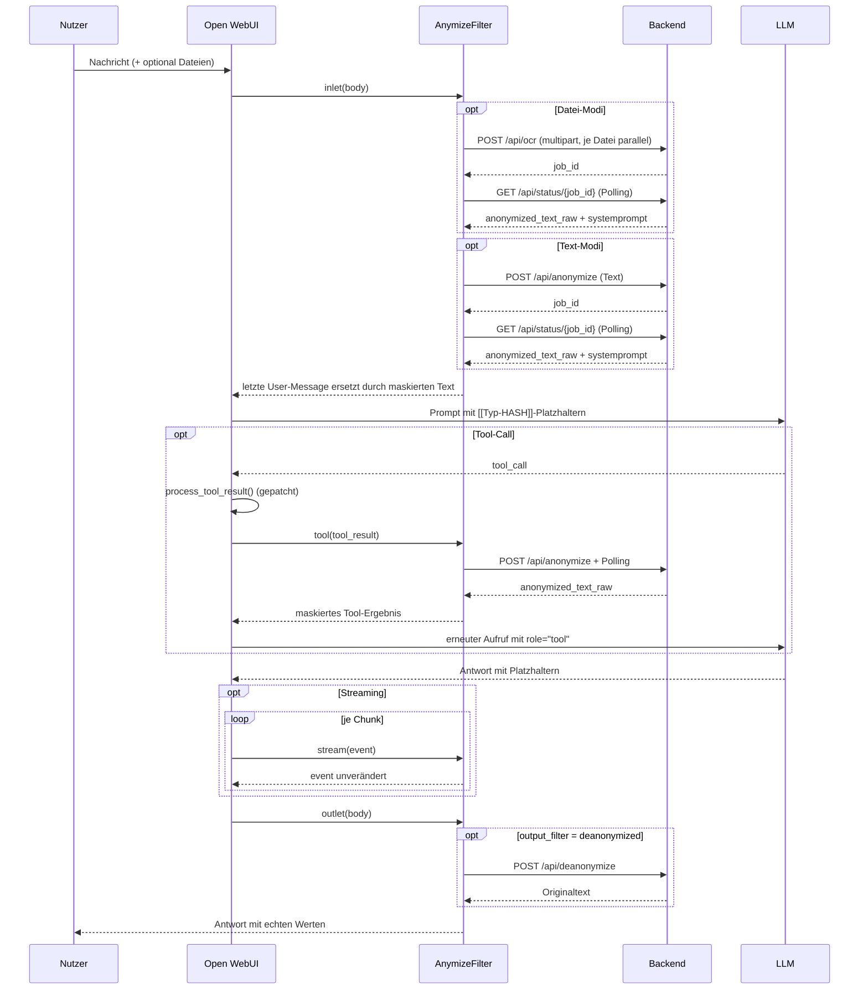

# AnonymizeFilter

Ein [Open WebUI](https://github.com/open-webui/open-webui)-Filter, der personenbezogene Daten (PII) aus Chat-Eingaben entfernt, bevor sie an ein LLM gehen — und sie in der Antwort wieder einsetzt.

Die Anonymisierung selbst passiert nicht lokal, sondern über die externe API. Der Filter ersetzt PII durch Platzhalter der Form `[[Typ-HASH]]` (z. B. `[[Person-QSEZB6]]`), schickt den maskierten Text ans Modell und macht die Maskierung nach der Antwort wieder rückgängig.

Der gesamte Filter steckt in einer Datei: [`anonymize.py`](anonymize.py).

---

## Funktionsweise



### Ablauf im Detail

1. **`inlet()`** wird von Open WebUI vor dem LLM-Aufruf gerufen und delegiert an `process_input()`.
2. **Dateien** (Modi `file_anonymization`, `text_file_anonymization`): `get_file_paths()` baut aus `body["files"]` die Pfade `UPLOAD_DIR/{file_id}_{filename}`. `process_multiple_files_for_ocr()` lädt alle Dateien parallel an `POST /api/ocr` hoch — zusammen mit der in der Valve `language` gesetzten Sprache —, sammelt die Job-IDs und pollt sie parallel bis `status == "completed"`. Ergebnis: `anonymized_text_raw` je Datei.
3. **Text**: der Text der letzten User-Message wird an den OCR-Text angehängt.
4. **Anonymisierung** (Modi `text_anonymization`, `text_file_anonymization`): der kombinierte Inhalt geht mit der konfigurierten Sprache an `POST /api/anonymize`, die zurückgegebene `job_id` wird über `GET /api/status/{job_id}` gepollt. Der von der API gelieferte `systemprompt` (Regeln zum korrekten Umgang mit Platzhaltern) wird an den Inhalt angehängt. Ist die Valve `store_hash_pairs` gesetzt, holt `_store_hash_pairs()` anschließend über `GET /api/status/{job_id}/strings` die vollständige Zuordnungstabelle und legt sie in `__metadata__` ab; im Default unterbleibt der Abruf (siehe [Datenschutz-Hinweis](#datenschutz-hinweis)).
5. **Ersetzen**: `final_content` ist immer der `anonymized_text_raw` der API, ergänzt um den `systemprompt`. Damit wird die letzte User-Message im `body` überschrieben. Open WebUI schickt sie so ans Modell — das LLM sieht nur Platzhalter.
6. **`tool()`** wird für jedes Tool-Ergebnis gerufen — nicht von Open WebUI, sondern aus dem Monkey Patch von `middleware.process_tool_result()`, den der Filter beim Laden installiert. Das bereits zu Text normalisierte Ergebnis läuft durch dieselbe Anonymisierung wie die User-Message und geht maskiert als `role="tool"`-Message ans Modell. Siehe [Tool-Ergebnisse](#tool-ergebnisse).
7. **`stream()`** wird bei aktivem Streaming für jeden Chunk der Antwort gerufen und gibt das `event` unverändert zurück — der Hook tut nichts.
8. **`outlet()`** wird nach der LLM-Antwort gerufen. Zuerst schreibt `_log_hash_pairs()` die in `__metadata__` gesammelte Zuordnungstabelle einmal ins Serverlog — nur, wenn `store_hash_pairs` gesetzt ist und damit überhaupt etwas gesammelt wurde. Danach: bei `output_filter = "deanonymized"` geht die Assistant-Nachricht an `POST /api/deanonymize`; das Ergebnis ersetzt die Antwort im Chat. Bei `"anonymized"` bleibt sie unverändert, die Platzhalter bleiben sichtbar.
9. **Statusmeldungen** („Processing files…", „Anonymizing content…", „Anonymizing result of &lt;tool&gt;…", „De-anonymizing content…") laufen über `__event_emitter__` und erscheinen im Chat-Verlauf.
10. **Fehler**: `inlet()` meldet `❌ Anonymization failed: …` und wirft eine Exception — die Anfrage geht nicht ans LLM. `tool()` wirft nicht, sondern ersetzt das Tool-Ergebnis durch die Fehlermeldung (fail closed). `outlet()` wirft ebenfalls nicht, sondern stellt der Originalantwort die Fehlermeldung voran, damit die Antwort nicht verloren geht.

---

## Installation

1. In Open WebUI: **Admin Panel → Functions → `+`** (neue Function anlegen).
2. Inhalt von [`anonymize.py`](anonymize.py) einfügen und speichern. Titel, Autor und Version zieht Open WebUI aus dem Docstring am Dateianfang.
3. Function aktivieren und entweder global oder pro Modell zuweisen.
4. Unter **Valves** den API-Key hinterlegen (siehe unten).
5. Im Chat lässt sich der Filter über sein Icon ein- und ausschalten (`self.toggle = True`). Ist er aus, geben `inlet()` und `outlet()` den `body` unverändert zurück.

---

## Konfiguration (Valves)

| Valve | Default | Bedeutung |
|---|---|---|
| `backend_url` | z.B. `https://app.anymize.ai` | Basis-URL des anymize-Backends, ohne Pfad. Nur ändern, um eine self-hosted oder Staging-Instanz anzusprechen. Ein abschließender `/` wird abgeschnitten; leer gelassen greift wieder der Default. |
| `anymize_api_key` | `""` | API-Key des Backends, Format z.B. `anymize_xxxxxxxxxxxxx`. Wird als `Authorization: Bearer …` gesendet. |
| `language` | `de` | Sprache der PII-Erkennung; gilt für `/api/anonymize` **und** `/api/ocr`. Mögliche Werte: `de`, `en`, `fr`, `es`, `it`. |
| `input_filter` | `text_anonymization` | Was vor dem LLM verarbeitet wird — siehe Modi unten. |
| `output_filter` | `deanonymized` | Was mit der LLM-Antwort passiert — siehe unten. |
| `tool_filter` | `true` | Maskiert das Ergebnis jedes Tool-Calls, bevor es das Modell sieht — siehe [Tool-Ergebnisse](#tool-ergebnisse). Braucht den Monkey Patch von `middleware.process_tool_result`, der beim Laden des Filters installiert wird. |
| `store_hash_pairs` | `false` | Ruft nach jeder erfolgreichen Anonymisierung die Zuordnungstabelle über `GET /api/status/{job_id}/strings` ab und sammelt sie in `__metadata__`; `outlet()` schreibt sie am Ende des Requests einmal ins Serverlog. ⚠️ Damit stehen die Originalwerte im Klartext im Log. Aus = die Tabelle wird gar nicht erst abgerufen. |
| `log_tool_payload` | `false` | Schreibt die Parameter jedes `process_tool_result()`-Aufrufs sowie jedes Tool-Ergebnis vor und nach der Maskierung vollständig ins Serverlog. ⚠️ Das rohe Ergebnis steht damit im Klartext im Log. Aus = kompakte Zeilen mit Typ, Länge und Korrelations-IDs. |
| `priority` | `10` | Ausführungsreihenfolge unter mehreren Filtern; kleinere Werte laufen zuerst. |

### `input_filter`-Modi

| Wert | Verhalten |
|---|---|
| `text_anonymization` | Nur die letzte User-Message wird über `/api/anonymize` maskiert. Dateien werden ignoriert. |
| `file_anonymization` | Angehängte Dateien laufen durch `/api/ocr` (OCR + Anonymisierung in einem Schritt). Maskiert wird gezielt nur der Dateiinhalt; der getippte Text der User-Message wird unverändert angehängt. Wer beides maskieren will, nimmt `text_file_anonymization`. |
| `text_file_anonymization` | Dateien per OCR **und** der kombinierte Gesamttext anschließend per `/api/anonymize`. |

### `output_filter`-Modi

| Wert | Verhalten |
|---|---|
| `deanonymized` | Antwort geht an `/api/deanonymize`, echte Werte werden wieder eingesetzt. |
| `anonymized` | Antwort bleibt unverändert; die Platzhalter `[[Typ-HASH]]` bleiben im Chat stehen. |

---

## Genutzte API-Endpunkte

Basis-URL: die Valve `backend_url`, per Default `https://app.anymize.ai`. Auth über `Authorization: Bearer <api_key>`. Alle Endpunkte unten hängen an dieser Basis, auch der Multipart-Upload nach `/api/ocr`.

| Endpoint | Zweck | Aufruf im Code |
|---|---|---|
| `POST /api/anonymize` | Text maskieren, liefert `job_id` | [`_anonymize_text()`](anonymize.py:431) |
| `GET /api/status/{job_id}` | Job-Status + `anonymized_text_raw` + `systemprompt` | [`_get_anonymization_status()`](anonymize.py:440) |
| `GET /api/status/{job_id}/strings` | Zuordnungstabelle Platzhalter ↔ Originalwert; nur bei gesetzter Valve `store_hash_pairs`, wird dann in `__metadata__` abgelegt und von `outlet()` ins Serverlog geschrieben | [`_get_hash_pairs()`](anonymize.py:444), [`_store_hash_pairs()`](anonymize.py:448), [`_log_hash_pairs()`](anonymize.py:489) |
| `POST /api/deanonymize` | Platzhalter zurück in Originalwerte | [`_deanonymize_text()`](anonymize.py:518) |
| `POST /api/ocr` | Datei (PDF, PNG, JPG, TIFF) per multipart, OCR + Anonymisierung | [`upload_file_from_path_for_ocr()`](anonymize.py:527) |


---

## Code-Aufbau

Alles in `class Filter` in [`anonymize.py`](anonymize.py):

| Gruppe | Methoden |
|---|---|
| Konfiguration | `Valves` (pydantic-Model), `__init__()` — setzt `toggle` und das Inline-SVG-Icon, `base_url` (Property) — Basis-URL aus der Valve `backend_url`, ohne abschließenden `/` |
| Zuordnungstabelle | `_get_hash_pairs()`, `_store_hash_pairs()` — Abruf und Ablage in `__metadata__`, nur bei gesetzter Valve `store_hash_pairs`; `_log_hash_pairs()` — Ausgabe der gesammelten Tabelle, einmal je Request aus `outlet()` |
| HTTP | `_anymize_api_request()` — aiohttp-Wrapper für GET/POST mit Bearer-Auth |
| API-Calls | `_anonymize_text()`, `_get_anonymization_status()`, `_deanonymize_text()`, `upload_file_from_path_for_ocr()` |
| Job-Polling | `_poll_status()` — pollt bis `status == "completed"`, `max_retries=150`, `retry_interval=10000` ms |
| Datei-Handling | `get_file_paths()`, `process_multiple_files_for_ocr()` — Upload und Polling parallel via `asyncio.gather()` |
| Orchestrierung | `_anonymize_content()` — ein Text von der Abgabe bis zum maskierten Ergebnis (Job, Polling, Zuordnungstabelle); genutzt von `process_input()` und `tool()`. `process_input()` — sammelt Inhalte, ruft die Anonymisierung, überschreibt die letzte User-Message |
| Open-WebUI-Hooks | `inlet()` (vor dem LLM), `stream()` (je Chunk, reiner Durchreicher), `outlet()` (nach dem LLM) — alle mit `__metadata__` |
| Tool-Ergebnisse | Modul-Ebene: `_unwrap()`, `_bind_tool_call()`, `_anonymize_tool_result()`, `_install_process_tool_result_patch()` — Monkey Patch. In der Klasse: `tool()` — siehe [Tool-Ergebnisse](#tool-ergebnisse) |

### Hash-Paare in `__metadata__`

> Dieser Abschnitt greift nur bei gesetzter Valve `store_hash_pairs`. Im Default wird die Tabelle nicht abgerufen, und in `__metadata__` steht nichts davon.

`__metadata__` ist ein Live-Dict, das Open WebUI durch den Request-Lebenszyklus reicht: was `inlet()` hineinschreibt, sieht `outlet()` desselben Requests ([Doku](https://docs.openwebui.com/features/extensibility/plugin/functions/filter/#data-passing-between-filters)). `_store_hash_pairs()` legt die vollständige Zuordnungstabelle dort für die spätere Nachbearbeitung ab — pro Request, nicht als geteilter Zustand der Filter-Instanz:

| Key (`Filter.METADATA_*`) | Inhalt |
|---|---|
| `_anymize_hash_pairs` | `List[Dict[str, Any]]` — ein Dict je erkannter Entität, **angehängt** über alle Jobs des Requests (Eingabe und Tool-Ergebnisse) |
| `_anymize_job_id` | `str` — Job-ID der Eingabe-Anonymisierung aus `inlet()` |
| `_anymize_tool_job_ids` | `List[str]` — Job-IDs der in diesem Request anonymisierten Tool-Ergebnisse, in Aufrufreihenfolge |

Zugriff in `outlet()`:

```python
hash_pairs = (__metadata__ or {}).get(Filter.METADATA_HASH_PAIRS_KEY, [])
```

Je Eintrag werden die in `Filter.HASH_PAIR_FIELDS` gelisteten Felder übernommen: `original`, `hash`, `prefix_name`, `placeholder`. Fehlende Felder werden als `None` abgelegt.

Beide Hooks deklarieren `__metadata__` mit Default `None`, und `_store_hash_pairs()` schreibt nur, wenn das Dict tatsächlich übergeben wurde **und** die Valve gesetzt ist. Ohne Metadata läuft die Anonymisierung unverändert weiter; die Paare landen dann nirgends, weil `_log_hash_pairs()` in `outlet()` genau aus diesem Dict liest.

Eine reale Antwort von `GET /api/status/{job_id}/strings` sieht so aus:

```json
{
  "job_id": "dcd158d9-c654-453b-872a-30180abbc48c",
  "count": 1,
  "hash_pairs": [
    {
      "original": "DS.1.3-2026-1899",
      "hash": "S28MBV",
      "prefix_name": "internal_id",
      "placeholder": "[[internal_id-S28MBV]]"
    }
  ]
}
```

`placeholder` trägt das vollständige Token in der Form, in der es im maskierten Text steht, `hash` nur den nackten Code.

**Ohne Hash-Paare bleibt die Maskierung intakt, die Rückabbildung nicht.** Die Zuordnungstabelle kann leer sein, weil der Abruf fehlgeschlagen ist, weil die API keine PII erkannt hat oder weil Zero Data Retention aktiv ist — ZDR ist eine Kontoeinstellung, kein Request-Parameter, und von hier aus nur daran sichtbar, dass `GET /api/status/{job_id}/strings` nichts liefert. Der maskierte Text kommt in allen Fällen weiterhin von der API; nur die De-Anonymisierung in `outlet()` findet dann keine Originalwerte mehr. `_store_hash_pairs()` schreibt in dem Fall eine Warnung ohne PII ins Log (`none returned`), ebenso wenn der Abruf selbst fehlschlägt (`unavailable`).

### Tool-Ergebnisse

Filter-Hooks decken nur die Chat-Grenze ab. Das Ergebnis eines Tool-Calls passiert weder `inlet()` noch `stream()` noch `outlet()`: Open WebUI führt das Tool in `utils/middleware.py` aus, normalisiert das Ergebnis in `process_tool_result()`, hängt es als `role="tool"`-Message an und ruft das Modell erneut — ohne die Filter-Kette erneut zu betreten. Ein Tool, das eine Akte, eine Datenbank oder ein Postfach liest, würde damit trotz aktivem Filter PII im Klartext ans LLM geben.

Deshalb patcht `anonymize.py` beim Laden `middleware.process_tool_result`:

```python
async def process_tool_result(request, tool_function_name, tool_result, tool_type,
                              direct_tool=False, metadata=None, user=None)
    -> (tool_result, tool_result_files, tool_result_embeds)
```

Die Funktion ist in `middleware` modulglobal definiert und wird über den Modul-Globalnamen aufgerufen — `middleware.process_tool_result = patched` greift deshalb für alle Aufrufstellen (natives und Prompt-basiertes Function Calling, MCP, `direct=True`-Tools).

**Der Wrapper läuft nach dem Original.** Zu diesem Zeitpunkt sind `dict`, `list`, `tuple`, `HTMLResponse` und MCP-Items bereits zu einem String normalisiert; `tool()` sieht also immer nur Text. Der String geht durch dasselbe `_anonymize_content()` wie die User-Message. Der `systemprompt` der API wird dabei **nicht** angehängt — er gehört an die User-Message, wo `inlet()` ihn bereits gesetzt hat.

**Fehler laufen fail closed**: schlägt die Anonymisierung fehl (Backend nicht erreichbar, Timeout), ersetzt `tool()` das Ergebnis durch `❌ Anonymization of the result of <tool> failed: … The result was withheld.` Das rohe Ergebnis erreicht das Modell nie; der Chat läuft weiter, das Modell sieht einen fehlgeschlagenen Tool-Call. Dasselbe gilt, wenn der Wrapper selbst scheitert.

Die Platzhalter aus Tool-Ergebnissen löst `outlet()` mit auf: `POST /api/deanonymize` arbeitet unabhängig vom Job.

Die Patch-Mechanik entspricht der von [`hook_logger.py`](hook_logger.py): `_PATCH_FLAG`/`_PATCH_ORIGINAL` markieren den eigenen Wrapper, `_unwrap()` schält ihn vor der Neuinstallation ab. Nötig ist das, weil Open WebUI das Function-Modul bei jeder Valve-Änderung neu ausführt — ohne Abschälen stapeln sich Wrapper, die die Valves einer alten Instanz lesen und je Tool-Call mehrere Anonymisierungs-Jobs auslösen würden. Fehlt `process_tool_result` (ältere Open-WebUI-Version), läuft der Filter ohne Tool-Anonymisierung weiter und schreibt eine Warnung ins Log.

**Statusanzeige**: `process_tool_result()` bekommt keinen Event-Emitter — der liegt im Aufrufer `tool_call_handler` als Closure-Variable. `tool()` baut sich deshalb über `get_event_emitter(__metadata__)` aus `open_webui.socket.main` einen eigenen, genau wie Open WebUI es für die Filter-Hooks tut; die Funktion liest `user_id`, `chat_id` und `message_id` aus dem Dict. Fehlt einer der Keys oder das Modul, entfällt die Anzeige stillschweigend, die Anonymisierung läuft weiter.

| Zeitpunkt | Statusmeldung |
|---|---|
| während des Jobs | „Anonymizing result of &lt;tool&gt;…" (sichtbar) |
| nach Erfolg | leer, `hidden` — die Meldung verschwindet |
| bei Fehlschlag | „❌ Anonymization of the result of &lt;tool&gt; failed: …", `done` — bleibt stehen |

**Aufruf-Logging**: Jeder Aufruf von `process_tool_result()` wird protokolliert, bevor das Original läuft — ein Aufruf, der danach hängt, ist damit trotzdem im Log sichtbar. Die Zeile listet alle Funktionsparameter mit Namen, gebildet aus den über `inspect.signature()` gebundenen Argumenten; kommen in einer künftigen Open-WebUI-Version Parameter dazu, erscheinen sie von selbst mit.

```
Anymize process_tool_result: request=<Request> tool_function_name='read_case' tool_result=<str len=1830> tool_type='mcp' direct_tool=False metadata={chat_id='…', message_id='…', session_id='…', user_id='…'} keys=17 user={id='…'} keys=9
```

Ohne `log_tool_payload` steht vom `tool_result` nur Typ und Länge in der Zeile — unabhängig davon, wie kurz es ist —, von `metadata` und `user` nur die Korrelations-IDs und die Anzahl der Keys, und von anderen Objekten Typ und Größe. Mit `log_tool_payload = true` steht jeder Parameter vollständig im Log, inklusive des rohen Tool-Ergebnisses.

Erwartete Logzeilen:

| Fall | Meldung |
|---|---|
| Patch installiert | `Anymize <version>: process_tool_result patch installed` |
| Modul neu geladen | `Anymize: replaced the process_tool_result patch of an older version` |
| Funktion fehlt | `Anymize: middleware.process_tool_result not found — tool results are NOT anonymized on this Open WebUI version` |
| Aufruf | `Anymize process_tool_result: <alle Parameter>` |
| Tool-Ergebnis maskiert | `Anonymize tool_result: name=<tool> len=<vorher> -> <nachher>` |
| Fehlschlag | `Anonymize tool_result failed: name=<tool> … — result withheld from the model` |

---

## Voraussetzungen

- **Open WebUI** — der Filter importiert `open_webui.utils.misc.get_last_user_message` / `get_last_assistant_message` und `open_webui.config.UPLOAD_DIR`. Außerhalb von Open WebUI läuft die Datei nicht.
- **Python-Pakete**: `aiohttp`, `pydantic` (beide in Open WebUI bereits vorhanden).
- API-Key eines Anonymisierungs-Dienstes.
- Für die De-Anonymisierung gilt laut API-Doku: der ursprüngliche Anonymisierungs-Job muss noch existieren, **Zero Data Retention (ZDR) muss im Account deaktiviert sein**, und nur derselbe Nutzer, der den Job erzeugt hat, darf de-anonymisieren. Mit aktivem ZDR liefert `/api/deanonymize` keine Originalwerte — dann ist nur `output_filter = "anonymized"` sinnvoll.

---

## Bekannte Einschränkungen

Stand der aktuellen Fassung von `anonymize.py` (Version 1.2.0):

- **Der Patch von `process_tool_result()` greift in Open-WebUI-Interna ein** und kann bei jedem Upgrade brechen. Ändert sich die Signatur, wird sie über `inspect.signature()` weiterhin korrekt gebunden; verschwindet die Funktion, entfällt die Tool-Anonymisierung stillschweigend bis auf eine Log-Warnung.
- **`tool_result_files` und `tool_result_embeds` bleiben unmaskiert**: Inline-HTML-Embeds und Bilder eines Tools reicht der Wrapper unverändert durch. Sie gehen an das Frontend, nicht an das LLM — im Chat sichtbare PII ist damit weiterhin möglich.
- **Jeder Tool-Call kostet einen eigenen Anonymisierungs-Job** inklusive Polling. Bei mehreren Tool-Calls je Antwort summiert sich das spürbar (siehe nächster Punkt).
- **Langes blockierendes Polling**: `_poll_status()` versucht es bis zu 150-mal im Abstand von 10 s ([anonymize.py:415](anonymize.py:415)) — im Extremfall hängt eine Anfrage 25 Minuten, bevor der Timeout greift.
- **Keine Streaming-De-Anonymisierung**: `stream()` existiert, reicht das `event` aber unverändert durch. Die De-Anonymisierung bleibt in `outlet()` auf der fertigen Nachricht, der Nutzer sieht während der Ausgabe weiterhin die rohen Platzhalter.
- **Nur die letzte User-Message wird anonymisiert**: Ältere Nachrichten des Verlaufs gehen unverändert ans LLM. In laufenden Unterhaltungen können frühere Klartext-PII also weiterhin mitgeschickt werden.
- **Job-ID im Log**: `logging.warning(f"Anymize JobID: …")` ([anonymize.py:640](anonymize.py:640)) schreibt die Job-ID jeder Anonymisierung auf Warn-Level ins Serverlog.
- **`__metadata__` ist nicht in jedem Aufrufpfad garantiert**: Laut Open-WebUI-Doku läuft `outlet()` bei WebUI-Requests und über `/api/chat/completed`; für direkte Aufrufe von `/api/chat/completions` braucht es `ENABLE_API_OUTLET_FILTERS` auf `dev`/kommenden Releases. In Pfaden ohne Metadata hat `store_hash_pairs` keine Wirkung: die Paare können nirgends abgelegt werden, und `outlet()` findet nichts zum Loggen.
- **Die De-Anonymisierung in `outlet()` ist ab Open WebUI 0.10 unsichtbar**: `outlet()` schreibt das Ergebnis nur nach `message["content"]` ([anonymize.py:939](anonymize.py:939)), das Frontend rendert eine Assistant-Nachricht seit 0.10 aber aus den strukturierten `message["output"]`-Blöcken und greift auf `content` nur zurück, wenn keine da sind (`ContentRenderer.svelte`: `{#if output?.length}`). Bei einer gestreamten Antwort sind sie immer da — sichtbar bleibt der aus den Stream-Chunks zusammengesetzte Text mit Platzhaltern. Dasselbe gilt für die Fehlermeldung im `except`-Zweig ([anonymize.py:970](anonymize.py:970)). Nötig ist, `content` **und** `output` zu schreiben; das Backend vergleicht beide getrennt und speichert beide. Ein Proof of Concept dafür steckt in [`hook_logger.py`](hook_logger.py) hinter der Valve `outlet_overwrite`.

---

## Datenschutz-Hinweis

Der Filter schickt Chat-Inhalte und hochgeladene Dateien an externe APIs — die Daten verlassen also die eigene Infrastruktur, bevor sie maskiert sind. Das ist bauartbedingt: die Erkennung der PII passiert extern, nicht lokal. Ob das zulässig ist, hängt vom Einsatzzweck und der vertraglichen Grundlage (Auftragsverarbeitung) ab.

**Die Zuordnungstabelle landet nur auf Anforderung im Log**: Mit `store_hash_pairs = true` ruft `_store_hash_pairs()` nach jeder Anonymisierung die Hash-Paare ab, sammelt sie in `__metadata__`, und `_log_hash_pairs()` schreibt sie am Ende des Requests aus `outlet()` per `logging.warning` ins Open-WebUI-Serverlog — inklusive der Originalwerte im Klartext (`original='Max Mustermann'`). Die PII steht damit unmaskiert an einer Stelle, die der Filter sonst gerade schützt; wer Logs weiterleitet, aggregiert oder langfristig aufbewahrt, sollte das einkalkulieren. Im Default ist die Valve aus, und die Tabelle wird gar nicht erst abgerufen.

**Tool-Ergebnisse laufen ebenfalls durch die externe API** — und mit `log_tool_payload = true` zusätzlich im Klartext ins Serverlog, vor und nach der Maskierung. Die Valve ist eine Debug-Hilfe und gehört im Regelbetrieb aus.

Die zweite Kopie in `__metadata__` ist dagegen auf den einzelnen Request begrenzt und wird mit ihm verworfen — kein geteilter Zustand zwischen Nutzern oder Chats.

Zero Data Retention ist eine Kontoeinstellung, kein Request-Parameter. Mit ZDR speichert das Backend keine Zuordnung zwischen Platzhalter und Originalwert — dann funktioniert die De-Anonymisierung in `outlet()` nicht mehr, und die Zuordnungstabelle landet weder im Log noch in `__metadata__`. Die Maskierung selbst bleibt davon unberührt, sie kommt immer von der API.

---

## Autor & Lizenz

- Filter-Code: `bbojan` — <https://github.com/Bojan227>, Version 1.0.0.
- Dieses Repository: <https://github.com/Matze2010/AnymizeFilter>.
- Lizenz: nicht festgelegt — es liegt keine Lizenzdatei bei.
